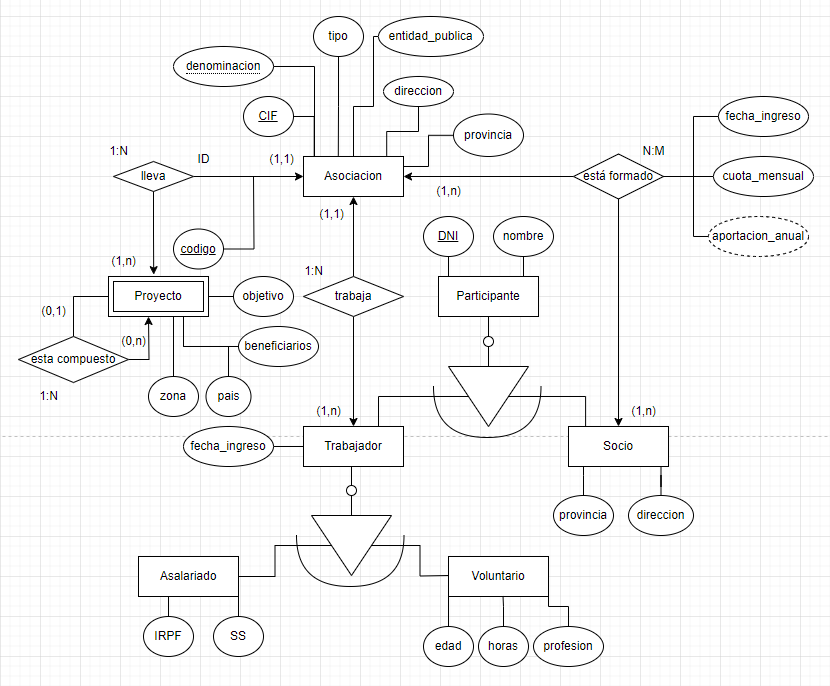

# Ejercicio 2

La coordinadora nacional de ONGs desea mantener una base de datos de las asociaciones de este tipo que existen en nuestro pais. 

Para ello necesita almacenar información sobre cada asociación, los socios que las componen, los proyectos que realizan y los trabajadores de las mismas.

De las asociaciones se desea almacenar su CIF, denominación, dirección y provincia, su tipo (ecologista, integración, desarrollo, …), así como si esta declarada de utilidad publica por el Ministerio del Interior.

Cada asociación esta formada por socios de los que se precisa conocer su DNI, nombre, dirección, provincia, fecha de alta en la asociación, la cuota mensual con que colaboran y la aportación anual que realizan (que se obtendrá multiplicando la cuota mensual por los meses del año).

Los trabajadores de estas organizaciones pueden ser de dos tipos: asalariados y voluntarios.

Los asalariados son trabajadores que cobran un sueldo y ocupan cierto cargo en la asociación. Se desea almacenar la cantidad que éstos pagan a la seguridad social y el tanto por ciento de IRPF que se le descuenta.

Los voluntarios trabajan en la organización desinteresadamente, siendo preciso conocer su edad, profesión y las horas que dedican a la asociación a efectos de cálculo de estadisticas.

Cada trabajador se identifica por su DNI, tiene un nombre y fecha de ingreso.

Un socio no puede ser trabajador de la asociación.

Las asociaciones llevan a cabo proyectos a los que están asignados sus trabajadores. 

De cada proyecto se desea almacenar su número de identificación dentro de la asociación, en qué pais se lleva a cabo y en que zona de este, así como el objetivo que persigue y el numero de beneficiarios a los que afecta. 

Un proyecto se compone a su vez de subproyectos.

  
Solución

  
  
  

[Video resolviendo el ejercicio](https://youtu.be/3SFKqUnN4Cc)
