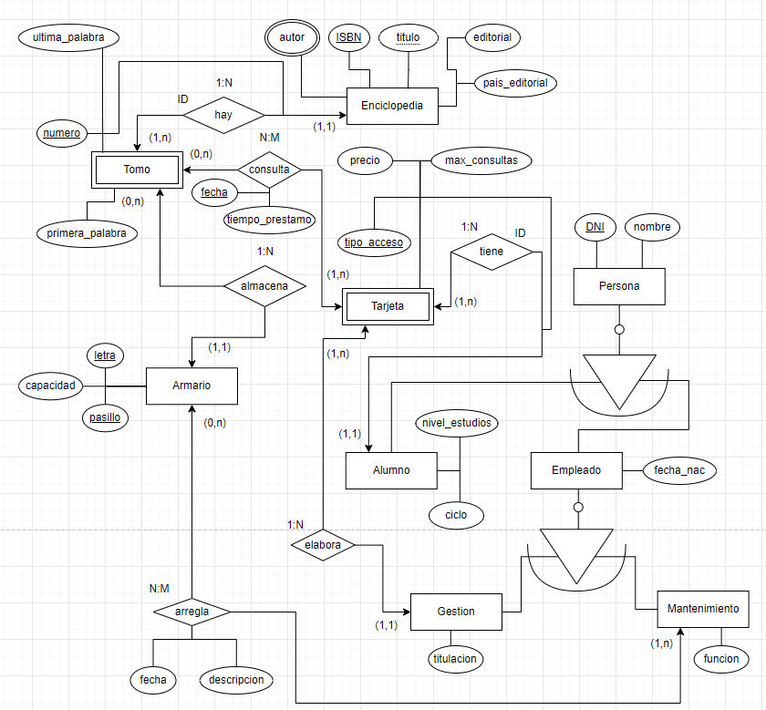

# Ejercicio 4

Lee atentamente la siguiente especificación de requisitos sobre la información a almacenar de una biblioteca para la gestión de las consultas a las enciclopedias por parte de los alumnos:
Dispone de enciclopedias formadas por varios tomos numerados ( I, II,III, IV,….). Esta numeración es igual para todos los tomos de las enciclopedias.

En la elaboración de las enciclopedias han participado varios autores y de cada enciclopedia almacenamos el ISBN, título, editorial y país de la editorial.

De cada tomo se almacena además del número de tomo y la primera y última palabra que contiene.

La consulta de los tomos se realiza a través de una tarjeta de acceso que incorpora, como se explica más adelante, el DNI del alumno, éste puede consultar más de una vez y con la misma tarjeta el mismo tomo, por lo que interesa guardar la fecha de consulta y durante cuánto tiempo lo tuvo cada vez.

Cada tarjeta tiene un tipo de acceso diferente a la biblioteca cada uno con un nº máximo de consultas permitidas y un precio.

Un alumno puede tener varias tarjetas de acceso pero de un tipo diferente cada una (por ello la entidad tarjeta tiene su clave primaria compuesta por dni+tipo_acceso), de cada alumno guardamos el DNI, nombre, ciclo formativo y nivel de estudios.

Hay que saber en qué armario se encuentra cada tomo. El armario se identifica por el número de pasillo y una letra, además se almacena también su capacidad.

En la biblioteca hay varios empleados (necesitamos almacenar algunos de sus datos personales como DNI, nombre y fecha de nacimiento). 

Unos se ocupan del mantenimiento de los armarios (de cada uno de estos tenemos que conocer qué tipo de función de mantenimiento tiene asignada), cuando realizan algún arreglo a un armario hay que anotar una breve descripción de lo que se le ha hecho y cuándo.

Otros empleados realizan solo tareas de gestión como la elaboración de las tarjetas de acceso (de estos interesa su titulación) y queremos conocer qué empleado ha sido el que ha elaborado cada una de las tarjetas.

  
Solución

  
  
  

[Video resolviendo el ejercicio](https://youtu.be/ZZ2dKyzIjic)